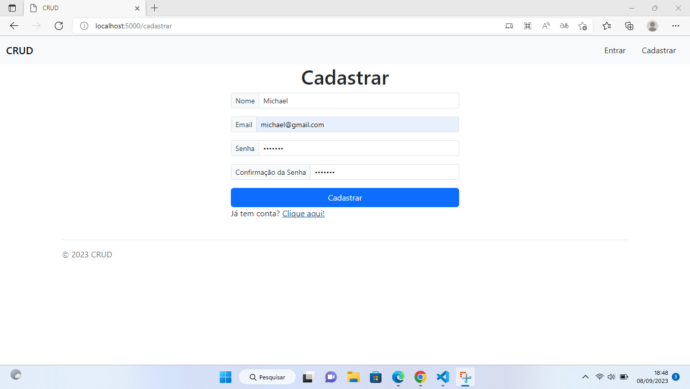
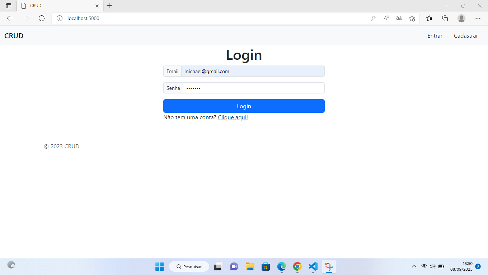
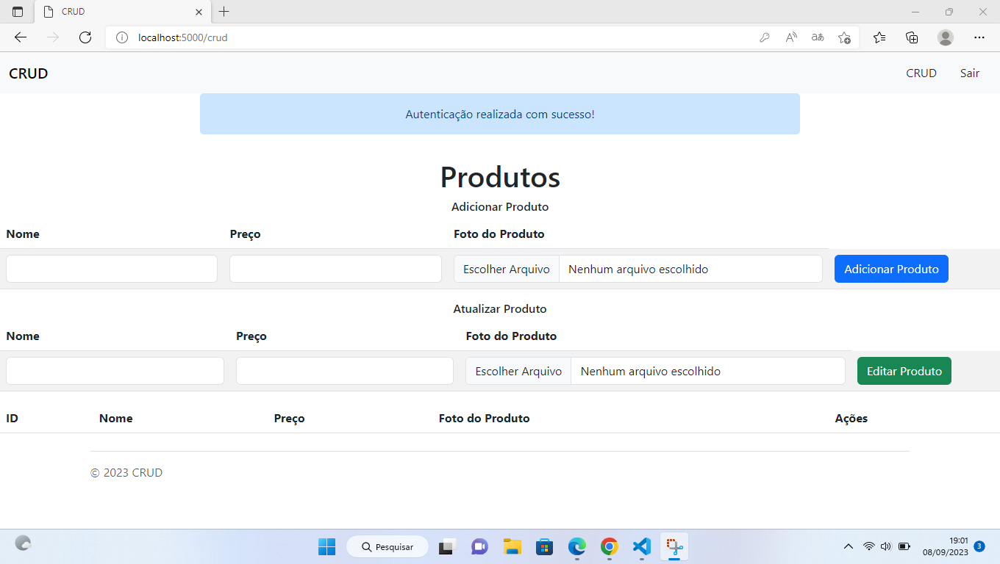
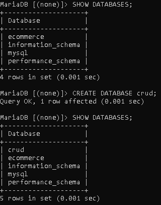
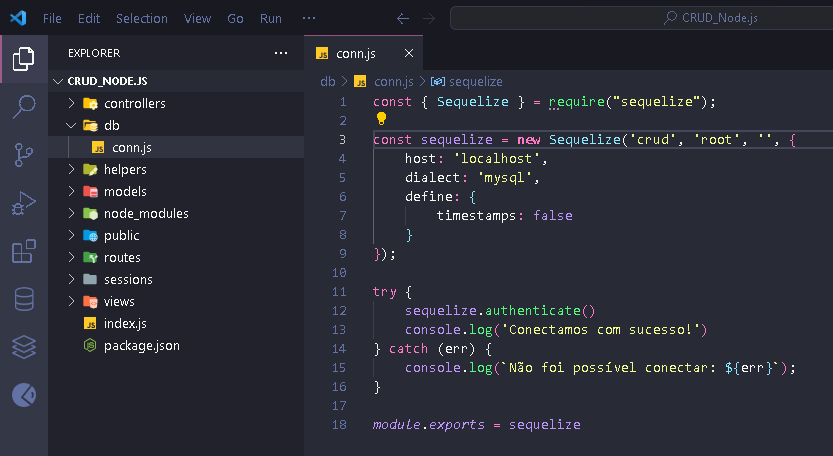

# CRUD de produtos com login e cadastro de usuário


#### É um CRUD de produtos feito com Node.js que permite adicionar, visualizar, atualizar e excluir produtos. 

## Funcionalidades do projeto

#### Para ter acesso ao CRUD primeiro terá que cadastrar um usuário e depois fazer login com usuário cadastrado.






## 🛠 Tecnologias e Ferramentas usadas na construção do projeto:

- [Visual Studio Code](https://code.visualstudio.com/)

- [Node.js](https://nodejs.org/en/)
- [MariaDB](https://mariadb.org/)
- Dependências do Projeto em NodeJS(package.json)  
```
"dependencies": {
    "bcryptjs": "^2.4.3",
    "cookie-session": "^2.0.0",
    "express": "^4.18.2",
    "express-flash": "^0.0.2",
    "express-handlebars": "^6.0.7",
    "express-session": "^1.17.3",
    "multer": "^1.4.5-lts.1",
    "mysql2": "^3.6.0",
    "nodemon": "^3.0.1",
    "sequelize": "^6.32.1",
    "session-file-store": "^1.5.0"
  },
```

## 🎲 Rodando o Projeto 

###### 1ª Clone este repositório
* git clone https://github.com/devjorgesousa/crud_nodejs.git

###### 2ª Acesse a pasta do projeto no terminal/cmd ou Visual Studio Code, após descompactar o arquivo crud_nodejs.zip.
* cd crud_nodejs

###### 3ª Instale as dependências.
* npm install

###### 4ª Crie um banco de dados chamado: crud.
* CREATE DATABASE crud;



###### 5ª Acesse a pasta db e altere a senha e o usuário do banco de dados do arquivo conn.js.


###### Se você não colocou senha no seu banco de dados, deixe então as aspas simples vazia ```''```.



###### 6ª Execute a aplicação.
* npm start

###### 7ª O projeto iniciará na porta: 5000 - Acesse: http://localhost:5000

## Esse projeto seguiu o padrão de arquitetura MVC (Model-View-Controller).

### O que é MVC?

MVC é nada mais que um padrão de arquitetura de software, separando sua aplicação em 3 camadas. A camada de interação do usuário(view), a camada de manipulação dos dados(model) e a camada de controle(controller).

**Model**
Sempre que você pensar em manipulação de dados, pense em model. Ele é responsável pela leitura e escrita de dados, e também de suas validações.

**View**
Simples: a camada de interação com o usuário. Ela apenas faz a  exibição dos dados, sendo ela por meio de um html ou xml.

**Controller**
O responsável por receber todas as requisições do usuário. Seus métodos chamados actions são responsáveis por uma página, controlando qual model usar e qual view será mostrado ao usuário.

## O diálogo das camadas

View: Fala Controller ! O usuário acabou de pedir para acessar o Facebook ! Pega os dados de login dele ai. Controller: Blz. Já te mando a resposta. Ai model, meu parceiro, toma esses dados de login e verifica se ele loga. Model: Os dados são válidos. Mandando a resposta de login. Controller: Blz. View, o usuário informou os dados corretos. Vou mandar pra você os dados dele e você carrega a página de perfil. View: Vlw. Mostrando ao usuário…

Fonte de pesquisa: [https://tableless.com.br/mvc-afinal-e-o-que/](https://tableless.com.br/mvc-afinal-e-o-que/)

